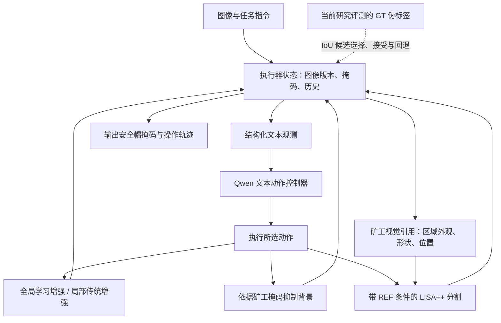

# 煤矿退化视觉下的引用驱动多轮分割：需求、方法与实现说明

整理日期：2026-09-17。依据本地恢复的源代码、PROJECT_LOG.md、历史实验归档与 A6000 复现结果。本文可直接转交 ChatGPT；其中“设计目标”“已实现机制”“已验证结果”分别表述，不把设想当作实验结论。

建议描述性名称：**面向煤矿退化视觉场景的引用驱动多轮分割与工具调度框架**。CMLLM 是项目名称，MR-LISA++ 指其中支持多轮引用的分割模型；这不是已发表方法的正式命名。

一句话理解：在昏暗、模糊、多人共存的煤矿图像中，先建立对某个矿工的明确视觉引用，再以该引用定位其安全帽；通过任务相关增强、局部处理和多步调用，提高获得正确目标掩码的机会。

## 1. 实际需求—思路—Framework

### 1.1 实际需求：找到“这个人的安全帽”，并给出像素位置

应用背景是煤矿视觉检查。图像可能存在低照度、噪声、模糊、遮挡；安全帽相对较小，同一画面又可能有多个矿工。实际需要解决的不只是“画面有没有安全帽”，还包括“所指矿工对应的是哪个安全帽，以及它的准确位置”。

一个具体交互例子：

1. 第一轮：“分割这个矿工。”得到矿工掩码。
2. 第二轮：“分割他戴的安全帽。”这里的“他”必须对应第一轮选中的矿工。
3. 如果当前图像难以分割，系统可以增强图像、依据已有掩码处理局部区域、抑制背景，再尝试分割。

当前落地任务是**单幅图像中的矿工→安全帽两轮引用分割，加上外层的多步工具调用**。它可以成为后续安全检查的定位模块，但目前没有完成事故风险判断、安全规程问答、跨帧人员跟踪或完整的未佩戴安全帽识别系统。

当前主要困难有三类：

- **看不清**：退化使安全帽边界与特征难以辨认，增强也可能同时放大噪声或改变特征。
- **指不准**：仅有“安全帽”类别信息不足以确定它属于哪个矿工，上一轮对象需要进入下一轮模型计算。
- **一次处理不够**：直接分割、先分矿工再引用、全局增强、局部增强可能产生不同结果，需要组织这些操作和保存中间状态。

### 1.2 核心思路：对象引用、任务相关增强、多步执行

**第一条：把上一轮掩码变成下一轮的视觉条件。**

上一轮矿工掩码不仅保存在聊天记录里，还用于构建参考区域的视觉特征、位置和形状表示，并注入 LISA 的语言与掩码生成路径。于是下一轮分割条件从“图像+安全帽指令”变为“图像+安全帽指令+指定矿工的视觉引用”。

**第二条：增强图像时考虑后续分割。**

更亮、更锐利不一定更容易被固定的分割模型识别。增强器保留重建约束，同时引入矿工和安全帽分割损失；当前采用较小分割损失权重，减少过强任务梯度带来的图像和预测偏移。

**第三条：将工具调用组织为带状态的多步流程。**

控制器选择操作，执行器维护图像版本、矿工掩码、目标掩码和历史结果，再调用下层工具。设计目标是根据状态选择下一步；当前恢复的实验能够证明流程可执行，但尚未证明内容自适应规划，详见后文。

### 1.3 整体 Framework

图中最后一条虚线是当前实现的重要边界：**控制器输入过滤了 GT IoU，但执行器仍利用 GT IoU 选择候选、判断接受和回退。** 因而当前是带 GT 辅助选择的研究评测流程，尚不能直接解释为无标注现场自主决策系统。这里的 GT 本身主要是 SAM 生成的伪标签。

框架有四个组成部分：

| 部分 | 输入与输出 | 作用 |
|---|---|---|
| 数据与引用训练 | 同图矿工—安全帽配对、两轮指令、反事实引用组 | 教会模型对应关系，并检查它是否真的依赖引用 |
| REF-conditioned LISA++ | 图像、文本、可选参考掩码→目标掩码 | 在模型内部把历史对象与当前分割关联起来 |
| 增强与聚焦工具 | 图像、可选区域掩码→处理后图像 | 改变当前观察条件，支持后续分割 |
| 控制器与执行器 | 结构化状态→动作→更新状态 | 组织多步调用、保存中间结果、执行回退与终止 |

上层控制器采用 Qwen2.5-0.5B-Instruct 加适配器，接收的是**文本化结构状态，不直接观察图像像素**；图像理解主要由下层 LISA++ 完成。各模块按阶段训练，当前不是所有模块联合训练的端到端强化学习系统。

## 2. Motivation—Contribution—Solution

以下“贡献”指可明确描述的项目方法贡献候选，并不表示已经通过文献检索确认学术首创性。

### 2.1 动机一：多轮对话可能保留文字，却丢失对象身份

**Motivation**

“他”“这个矿工”等词语需要对应一个具体图像区域。如果模型主要依靠类别和场景先验，即使文本里出现上一轮对象，也可能一直分割同一个显著安全帽。只看普通分割精度，难以区分它是真的理解引用，还是恰好猜中。

**Contribution 候选**

将参考对象的外观与几何信息接入 LISA 内部，并构造同图同问、不同参考对象的训练与评测，显式约束引用条件下的目标区分能力。这是当前方法中最清楚、最值得作为核心机制展开的部分。

**Solution：两条 REF 信息通路**

1. **输入端视觉引用。** 根据矿工掩码遮掉参考对象之外的像素，裁剪参考区域，提取 CLIP 视觉特征，并融合边界框表示。将映射后的表示加到语言模型的 `[REF]` token 嵌入中，让引用信息通过语言模型影响分割 token。
2. **输出端掩码条件。** 将 `[REF]` 隐状态与参考掩码的粗粒度形状、边界框编码结合，形成参考上下文，再加入送往 SAM 掩码解码器的分割提示表示。恢复的 w15 配置采用加法融合。

可用概念公式概括，不替代代码中的具体投影、归一化和尺度处理：

\[
r_{in}=f_{in}(\operatorname{CLIP}(\operatorname{Crop}(I,M_{ref})),b_{ref}),
\quad e_{REF}\leftarrow e_{REF}+\alpha r_{in}.
\]

\[
r_{out}=f_{out}(h_{REF},\operatorname{Downsample}(M_{ref}),b_{ref}),
\quad p_{seg}=W_{seg}h_{SEG}+\beta r_{out}.
\]

\[
\hat M_{target}=\operatorname{SAMDecoder}(F_{image},p_{seg}).
\]

这里 \(I\) 是当前图像，\(M_{ref}\) 是矿工参考掩码，\(b_{ref}\) 是其位置。不能把配置中的引用缩放系数描述成一个已验证的动态可信度门控机制。

**反事实引用训练。** 同一幅图像中选择矿工 A、B，保持第二轮问题相同，分别给出 A、B 的引用，目标应分别切换为 A、B 的安全帽。除文本、BCE/Dice 掩码和引用掩码重建损失外，增加排序约束。令 \(S_{ij}\) 为第 \(i\) 个引用条件下预测的安全帽与第 \(j\) 个目标的 soft IoU，则组内排序项为：

\[
\mathcal L_{rank}=\frac{\lambda}{N}\sum_i
\max\left(0,m+\max_{j\ne i}S_{ij}-S_{ii}\right).
\]

含义是：当前预测与自己对应目标的匹配，应优于它与组内其他矿工目标的匹配。恢复的 w15 分支使用排序权重 1.5、margin 0.05。该机制的合理性可以明确解释；其独立因果收益仍应由配置一致的消融支持，不能把所有历史训练差异都归因于这一项。

### 2.2 动机二：图像增强的视觉效果与分割收益不一致

**Motivation**

传统增亮、去噪、局部对比度处理可以改善观感，也可能改变分割模型依赖的纹理与边界。历史实验确实出现增强后分割变差、需要回退的情况，因此不能把增强视为必然有益的前处理。

**Contribution 候选**

围绕后续矿工与安全帽分割共同训练增强器，在恢复图像与保持下游识别特征之间做权衡。当前是具体任务适配方案，尚不足以声称普适最优增强。

**Solution：低权重双任务分割反馈**

先用轻量 U-Net 学习合成退化图像到原图的恢复，再固定 LISA++ 权重，对增强图像分别执行“分割矿工”和“分割安全帽”两个直接提示，将分割误差反馈给增强器。

恢复的 v3-lowseg 配置概括为：

\[
\mathcal L_E = \mathcal L_{align}
+0.005\mathcal L_{miner}
+0.01\mathcal L_{helmet}
+1.0\mathcal L_{teacher}
+0.08\mathcal L_{residual}
+0.08\mathcal L_{color}
+0.005\mathcal L_{TV}.
\]

其中 align 包含区域相关重建与边缘约束；teacher 约束增强结果接近较稳定的 v1 增强器。分割损失用较小权重参与微调。当前实现中，分割反馈通过可微的 SAM 图像分支传到增强图像；CLIP 图像处理分支存在 detach，不能描述为所有视觉路径都可微的联合训练。

工具实现也需要区分：最佳配置的**全局增强**使用学习到的 v3-lowseg；**局部增强**仍使用传统处理并柔和融合回整幅图像。动作名中有普通和强全局增强，但装载学习增强器后，两者调用同一增强模型，不代表两个不同强度的学习模型。

### 2.3 动机三：直接分割失败后需要可组织、可恢复的后续操作

**Motivation**

当目标太小或背景干扰大时，先得到面积更大的矿工区域，再通过它寻找安全帽，是一条可尝试的替代路径。增强可能失败，中间结果也可能变差，因此流程需要保存历史图像和掩码。

**Contribution 候选**

建立包含直接分割、对象引用、增强、聚焦和回退的可执行动作接口，并用语言模型学习结构化动作输出。当前已实现多步工具执行；“自适应规划优于固定流程”仍是待验证主张。

**Solution：文本策略模型与有状态执行器**

执行器将步数、状态标志、可观测掩码统计和近期历史整理成文本；策略模型输出类似 `{"action_index": 9}` 的动作。执行器完成调用后更新状态，再进入下一步。

动作空间共 16 项，涵盖直接目标分割、两种全局增强动作、目标局部增强及重分割、矿工分割与局部处理、矿工背景抑制、REF 目标分割与局部处理、两种回退、成功或失败停止。

历史训练先模仿规则轨迹进行 SFT，再尝试用候选 rollout 的离线偏好做 DPO。DPO 在已记录的集成评测中没有超过 SFT，本次恢复使用 SFT-v2。不能称为已证实 DPO 带来增益，也不能称为在线 PPO/GRPO 训练。

**当前必须保留的两个结论边界：**

- 执行器利用 GT IoU 更新最佳候选、接受结果和处理回退。仅从策略文本中移除 IoU，并没有消除整个系统的 GT 依赖。
- 本次 30 个样本的动作序列完全相同，均用满 14 步，没有主动选择 STOP。因此尚无这次实验所支持的样本自适应规划、提前停止或节省调用成本结论。

## 3. 具体流程

### 3.1 离线数据构建

1. 从煤矿图像及安全帽框标注出发，使用 SAM 生成安全帽伪掩码。
2. 用矿工检测器在这些图像上发现矿工，使用 SAM 生成矿工伪掩码。
3. 根据位置和人体—头部关系配对矿工与安全帽，经过规则、模型辅助检查和人工查看，形成两轮任务。
4. 对同一图像含多个对应对象的情况，构建同问不同 REF 的反事实组。
5. 按归档划分形成常规样本和反事实样本。训练使用原图及掩码监督，退化分支额外构造低照度、噪声和模糊。

历史最终混合训练表记录为 13,455 条：9,724 条常规训练样本与 3,731 条分组反事实样本；常规 holdout 为 2,494 条，反事实 holdout 为 921 条。这些是历史数据构建记录，并非本次已重新跑完的全部评测。

这里的监督主要来自伪标签，不能称为完整人工精标。划分依据图像路径标识，也不能直接声称已经按矿区、摄像头或视频序列完成严格独立划分。

### 3.2 分阶段训练

**阶段 A：训练引用分割模型。**

在 LISA 基础上接入两条 REF 通路，用矿工→安全帽任务训练指令、掩码及引用关联；用反事实组和排序约束促使模型随引用对象改变输出。本次使用已恢复的 MR w15 合并权重。

**阶段 B：训练增强器。**

先做重建训练，再冻结分割模型，通过矿工与安全帽两种直接分割任务微调增强器。当前 v3-lowseg 历史微调设置为 300 条训练、50 条验证、2 个 epoch、学习率 5e-6。它属于小规模任务适配实验。

**阶段 C：训练动作控制器。**

从规则执行记录构造“状态文本→动作索引”的 SFT 数据；后续用候选轨迹偏好尝试 DPO。分割模型、增强器与控制器不是一次性共同优化。

### 3.3 推理时的数据如何流动

以下描述工具接口与设计逻辑，并不代表当前策略已经学会所有条件分支：

1. 输入图像与任务，初始化图像版本、掩码和历史状态。
2. 尝试直接分割安全帽，保存候选。
3. 根据动作调用全局增强，再尝试目标分割；也可依据已有目标候选处理局部区域。
4. 获取矿工掩码，将其作为 anchor，即后续安全帽定位所依赖的参考对象。
5. 可将矿工掩码适度膨胀并抑制其外背景，减少其他对象干扰。
6. 由矿工掩码生成 REF 外观与几何表示，把图像、目标指令和 REF 送入 LISA++，得到该矿工对应的安全帽候选。
7. 可围绕目标继续局部增强、重新分割、回退到历史状态。
8. 输出候选掩码和完整操作轨迹。当前执行器以 GT IoU 辅助选择结果；实际无标注部署需要移除这一依赖。

局部增强是在原图坐标中融合 ROI 处理结果，不应解释为天然获得了额外分辨率或细节信息。另外，当前分割执行器使用含 `[SEG]` 的模板进行前向预测，不能仅据此宣称模型产生了自由文本的多步视觉推理。

### 3.4 本次恢复模型实际执行的 14 步

30 个样本全部执行了下面同一序列：

| 步骤 | 动作 | 实际操作 |
|---:|---|---|
| 1 | SEG_TARGET_DIRECT | 直接分割安全帽 |
| 2 | GLOBAL_ENHANCE | 全局增强 |
| 3 | SEG_TARGET_DIRECT | 再次直接分割 |
| 4 | GLOBAL_ENHANCE_STRONG | 调用全局增强接口；当前仍为同一学习增强器 |
| 5 | SEG_TARGET_DIRECT | 再次直接分割 |
| 6 | LOCAL_ENHANCE_TARGET | 依据目标候选做局部增强 |
| 7 | SEG_TARGET_LOCAL | 在处理后的图像上分割目标 |
| 8 | ROLLBACK_LOCAL_RESULT | 执行局部结果回退动作 |
| 9 | SEG_ANCHOR | 分割矿工 |
| 10 | BLACKOUT_WITH_ANCHOR | 依据矿工掩码抑制背景 |
| 11 | SEG_TARGET_WITH_REF | 使用矿工 REF 分割安全帽 |
| 12 | LOCAL_ENHANCE_REF_TARGET | 依据 REF 路径的目标候选做局部增强 |
| 13 | SEG_REF_TARGET_LOCAL | 再次执行 REF 目标分割 |
| 14 | ROLLBACK_LOCAL_RESULT | 再次执行局部回退动作 |

达到步数上限后，所有样本都进入 `max_steps_best_target` 分支，输出按 GT IoU 维护的最佳目标候选。因而本次最终指标包含沿途多个候选的 GT 辅助选择收益，不能直接等同于无标注条件下最后一次预测的性能。

## 4. 现有证据与能够支持的结论

### 4.1 已经复现的结果

固定组合为：LISA++ MR w15、SFT-v2 控制器、v3-lowseg 增强器、target15_b 合成退化、最多 14 步；矿工和目标 IoU 接受阈值均为 0.5，固定 target/anchor/ref-target ROI 尺度为 1.2/1.5/1.2。

| 指标 | 2026-05-28 历史归档 | 2026-09-17 A6000 复现 |
|---|---:|---:|
| 评测样本数 | 30 | 30 |
| 接受数量 | 14/30 | 14/30 |
| 最终目标 mean IoU | 0.401399 | 0.401449 |
| 最终矿工 anchor mean IoU | 0.747881 | 0.748721 |
| 非法动作数 | 0 | 0 |
| 平均步数 | 14 | 14 |

本次初始目标 mean IoU 为 0.211929，最终为 0.401449。该变化是在同一执行流程中的观察，包含多次预测、图像处理、引用分割及 GT 辅助候选选择，**不能作为单个模块的独立增益，也不能当成真实部署收益**。

复现说明恢复后的代码和权重能运行，且该历史配置的接受数量、平均目标 IoU、逐样本决策和动作序列基本得到了对应复现。它不代表所有实验、所有模块贡献或论文层面的结论都已重新验证。

### 4.2 需要一起转交的边界

1. **当前执行器依赖 GT。** 这是部署主张最关键的限制，不能省略。
2. **当前轨迹未显示自适应。** 30 个样本同一序列、同一 14 步预算，不能声称已验证自适应规划或提前停止。
3. **本次仅评测 30 个样本。** 这批样本此前也用于开发和退化标定，不能当作完全未接触的独立最终测试集；target15_b 是经验选取的合成退化配置，不能外推为真实煤矿低照度分布上的全面稳健性。
4. **评测掩码是重建的。** 原图从原始数据压缩包恢复，掩码按归档 SAM 流程重新生成；缺少原掩码，无法证明逐像素一致。本次均值接近，但单样本 IoU 最大绝对差约 0.0382。
5. **DPO 没有被本次恢复验证。** 恢复的是历史上与 DPO 并列的 SFT-v2，最新 DPO 适配器未恢复；既有日志也未显示 DPO 优于 SFT。
6. **学术贡献还需要分别检验。** 需要独立评估 REF 机制、任务增强和控制策略，避免把集成成绩全部归于“智能体推理”。这是一项后续验证要求，不是本次已完成的实验。

## 5. 可直接发给 ChatGPT 的分析任务

请基于上述已实现项目，帮助梳理“煤矿退化视觉中的引用驱动多轮分割”这条方法主线。重点分析：上一轮矿工掩码如何通过视觉与几何通路约束下一轮安全帽分割；反事实引用训练解决什么失效问题；任务相关增强如何与引用分割配合；工具控制部分目前能承担什么角色。

请分别输出实际需求、研究问题、方法机制、贡献候选、训练流程、推理流程及必要的验证实验。保留现有实现与未来设想的区别，不把 GT 辅助候选选择写成无标注自主判断，不把固定动作轨迹写成已验证的自适应规划，不虚构 DPO 增益、真实场景泛化或文献首创性。若建议改进，请单独标注为“待实现/待验证”。

## 6. 项目内依据

- 项目过程与历史实验：`PROJECT_LOG.md`。
- 本次复现：`research_log/a6000_best_reproduction_20260917/RESULT.md` 及其同目录的 summary、traces、episode_comparison。
- REF 模型：`cmllm_remote/third_party/LISA/model/LISA.py`，以及 `model/llava/` 下的语言模型与多模态输入实现。
- 引用数据：`cmllm_remote/third_party/LISA/utils/mr_ref_seg_dataset.py`、`cmllm_remote/scripts/build_mr_ref_counterfactual_train.py`。
- 增强器：`cmllm_remote/scripts/train_task_enhancer_v1.py`、`train_task_enhancer_v3_dual_direct_loss.py`。
- 工具与执行器：`cmllm_remote/scripts/stage3_rule_controller_v3_seg_local_enhance.py`、`stage3_policy_v2_rollout.py`。
- 控制器数据与训练：`cmllm_remote/scripts/build_controller_policy_dataset_v2.py`、`build_controller_policy_rollout_preferences_v4.py`、`train_controller_policy_sft.py`、`train_controller_policy_dpo.py`。

以上为项目内部证据索引，不是外部论文引用。
