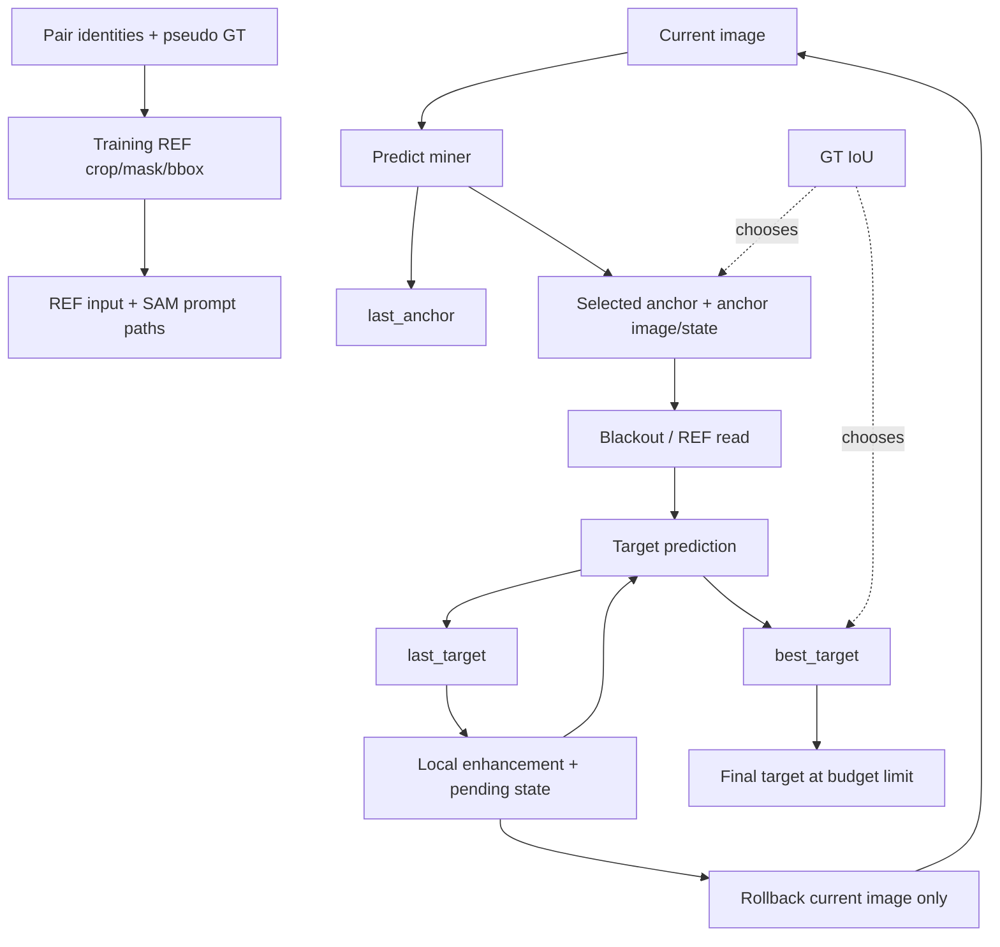

# Current REF / anchor / executor state flow

Inspected at baseline `5f4c2ba`. These are implementation facts and candidate failure locations, not measured failure frequencies. Cycle 001 leaves all files described below unchanged.

## Write / read map

| Location | Write/read | Identity and GT implications |
|---|---|---|
| `scripts/build_mr_ref_counterfactual_train.py::build_counterfactual_episode`, `pair_to_training_pair` | Group `pair_ids`, same query, miner/helmet mask paths and bboxes | Pair IDs supply identity association for offline supervision; data are mostly pseudo-labels |
| `third_party/LISA/utils/mr_ref_seg_dataset.py::_getitem_counterfactual`, `_getitem_single_pair` | Read miner GT masks to create `ref_masks`, `ref_bboxes`, `ref_images_clip`, valid flags; interleave miner/helmet targets | Second-round training REF is supplied GT/pseudo-GT, not the model's first-round prediction; training alone does not establish robust memory writing |
| `third_party/LISA/model/LISA.py::build_ref_input_embeddings` | Read crop CLIP features + bbox, project into LLM space | Existing appearance/position encoder; no persistent entity ID or reliability |
| `model/llava/model/language_model/llava_llama.py::_replace_ref_input_embeddings` | Inject projected reference into `[REF]` embeddings | Input reference affects the LLM computation; reuse this mechanism |
| `LISA.py::build_ref_prompt_embeddings`, `model_forward` | Read REF hidden state + pooled mask/bbox, fuse into SAM prompt; rank correct vs maximum wrong target | Geometry/context read path; group identity is positional alignment, not a retrieval store |
| `stage3_policy_v2_rollout.py::run_policy_episode` | Initialize current image/state; `SEG_ANCHOR` and `SEG_ANCHOR_LOCAL` predict miner and call `update_anchor` | No explicit stable identity key. Generic resegmentation can return another miner |
| `stage3_policy_v2_rollout.py::update_anchor` | Always write `last_anchor*`; overwrite `anchor`, `anchor_quality`, `anchor_image`, `anchor_state` only if GT IoU improves | Best-anchor bank is oracle-selected; latest and selected anchor can differ |
| `BLACKOUT_WITH_ANCHOR` branch | Read selected anchor mask and its saved image; produce focused current image | Background focus depends indirectly on oracle anchor choice |
| `SEG_TARGET_WITH_REF`, `SEG_REF_TARGET_LOCAL` branches | Read selected anchor + bbox with current/local target image | Mask and current image can come from different processing versions |
| `stage3_rule_controller_v3_seg_local_enhance.py::ControllerRunner.build_item` | Rebuild REF appearance crop from the image passed to this prediction | Appearance is recomputed from current pixels, not retrieved from the original anchor image; geometry/appearance versions may diverge |
| `stage3_policy_v2_rollout.py::update_best_target` | Always write `last_target*`; best target fields update on higher GT IoU | Final target bank is also oracle-selected, including REF candidates despite the rollback action's “DIRECT” name |
| `LOCAL_ENHANCE_*` branches | Write `pending_local` image/ROI/base quality | Target path saves base image/state; anchor/ref-target paths omit them and rollback falls back to best target state |
| `ROLLBACK_LOCAL_RESULT` | Restore current image/state, clear pending local | Does not restore anchor or last/best target masks. A local image rollback is not an atomic memory rollback |
| `build_controller_policy_dataset_v2.py::make_observation` | Read sanitized history and inferred flags | Strips IoU/deltas and bboxes; policy sees text, not pixels. All 16 action indices remain exposed, not a dynamic legal-action mask |

## Exact oracle boundary

- `score_seg(pred, gt)` constructs `quality['iou']`. `is_miner_ok` and `is_target_ok` threshold it; target acceptance may additionally check observable geometry.
- `update_anchor` and `update_best_target` compare GT IoU. Fields derived from those selected masks/images remain oracle-influenced after scalar filtering.
- Local branches compute IoU delta against `pending_local['base_quality']`; accept/keep/rollback labels use it. In the policy executor these labels alone are **not** a learned verifier or automatic rollback operation; actual rollback is a separate selected action.
- `STOP_SUCCESS` and max-step final decisions use GT acceptance. `max_steps_best_target` selects from the oracle best-target bank.
- `ROLLBACK_TO_BEST_DIRECT` reads that bank (not necessarily direct-only). Local fallback can read its image/state as well.
- Offline SFT/preference builders also use GT-derived labels/reward. Supervised training may use labels, but those labels must not re-enter deployment candidate selection.
- `ControllerRunner.predict` still accepts `target_mask` and passes it in the batch. In the inspected inference path, LISA returns predictions before segmentation/rank losses; the target also supplies output-size bookkeeping. This is not proof of target-pixel-conditioned mask decoding, but a future oracle-free runner should remove the GT requirement rather than claim the existing interface is GT-free.

## Four failure questions, tied to concrete code

1. **Write corruption:** replace supplied training/eval GT REF with a fixed predicted miner mask under degradation, then measure target association loss. Current data recipe cannot answer this by itself.
2. **Retrieval ambiguity:** current executor holds a single anchor, not a competing-entity retrieval store. Same-image different-REF evaluation tests reference discrimination; do not label it a tested multi-entity retrieval system.
3. **Update drift:** miner resegmentation has no persistent identity constraint, REF appearance is rebuilt from new pixels, and image-only rollback leaves mask state untouched. These are candidate drift points to instrument, not demonstrated error rates.
4. **Memory ignorance:** identical predictions across different REF identities can indicate saliency/category shortcuts. Full IoU matrix and joint switch success expose this more clearly than ordinary target mIoU.

## Minimal addition this cycle

`entity_memory.py` groups mask, bbox, image, features, provenance, nullable reliability and version in copy-isolated snapshots. It records candidates and can restore a whole snapshot. The anchor adapter marks old GT selection instead of treating IoU as reliability. It is intentionally standalone: none of the old executor's behavior or reproduced numbers changes.
