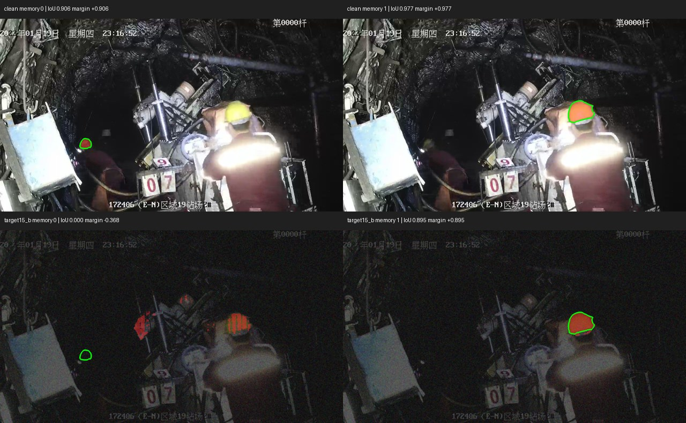
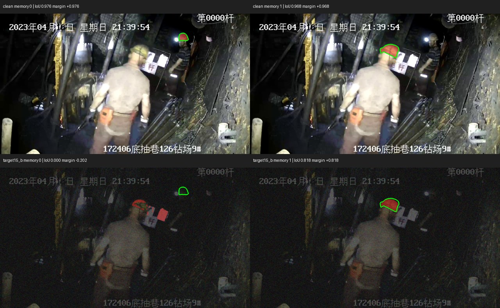
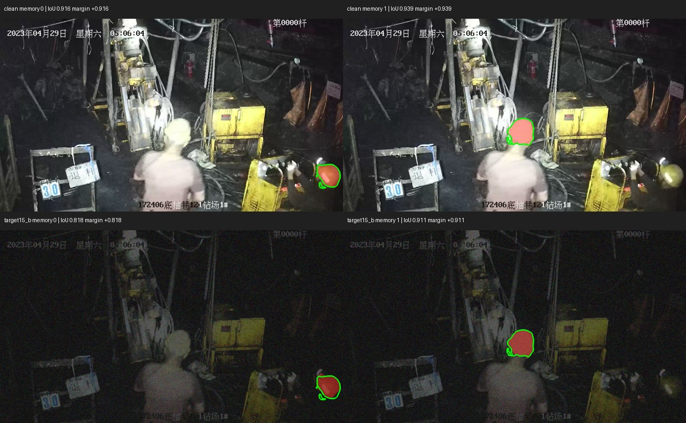
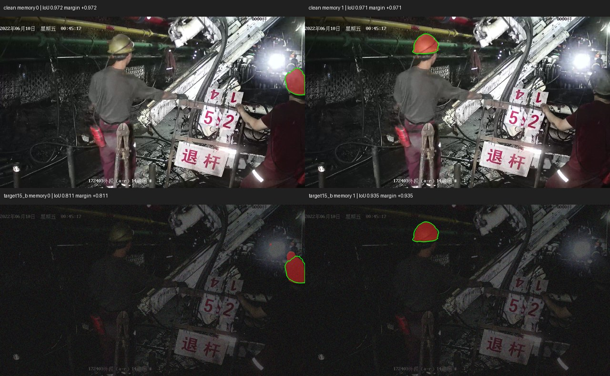
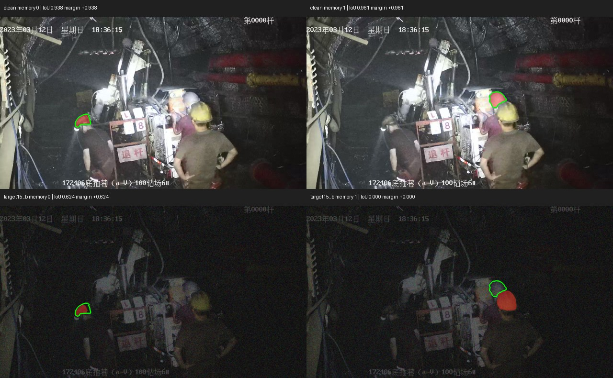
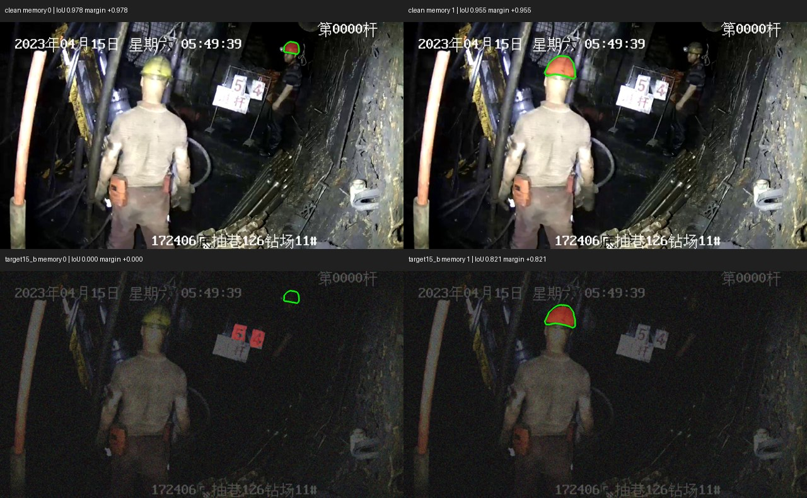

# Cycle 003 paired diagnostic

Regenerated pseudo-masks; frozen w15; no tuning. Delta = target15_b minus clean.

| Metric | Clean | target15_b | Delta |
|---|---:|---:|---:|
| target_miou | 0.943108 | 0.631131 | -0.311977 |
| cmsa | 0.966667 | 0.466667 | -0.500000 |
| memory_fidelity | 1.000000 | 0.816667 | -0.183333 |
| identity_error_rate | 0.000000 | 0.000000 | +0.000000 |
| mean_identity_margin | 0.943108 | 0.621451 | -0.321658 |
| median_identity_margin | 0.958937 | 0.814648 | -0.144289 |

## Deterministic gallery

Predictions: red fill. Corresponding target pseudo-mask: green outline. Rows: clean/degraded; columns: memory A/B.

Select 2 largest negative group-mean margin deltas, then up to 2 unused groups with highest degraded IER, then up to 2 stable successes by group ID. Fill shortfall by margin delta; never choose for appearance. Group ID breaks ties.

### cf_e8e8fa40c6ef55f7

Rule: largest_negative_margin_delta; diagnostic: low_quality_without_clear_swap; margin delta -0.678456.

### cf_d32ae4c94aab36c5

Rule: largest_negative_margin_delta; diagnostic: low_quality_without_clear_swap; margin delta -0.663510.

### cf_023f89d30d90720b

Rule: stable_success; diagnostic: stable_success; margin delta -0.062684.

### cf_040619a5f3f909a5

Rule: stable_success; diagnostic: stable_success; margin delta -0.098420.

### cf_1d6ec3bdbac51fdb

Rule: fill_remaining_by_margin_delta; diagnostic: low_quality_without_clear_swap; margin delta -0.637566.

### cf_1d77b0f7a4f34726

Rule: fill_remaining_by_margin_delta; diagnostic: low_quality_without_clear_swap; margin delta -0.555837.

