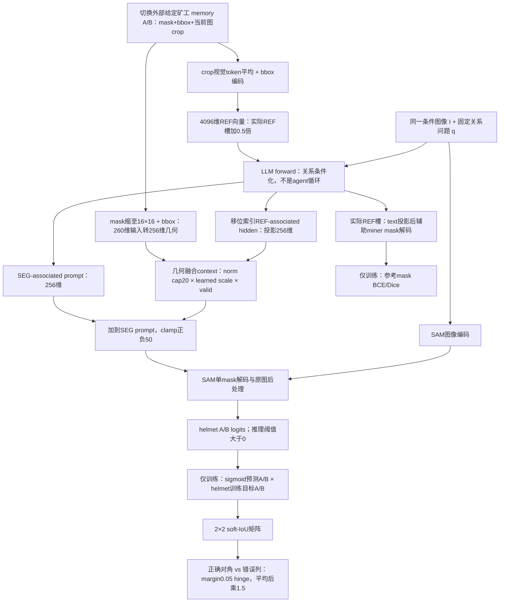

# 教学流程：先指定谁，再找属于他的装备

索引要点：H不是注入REF槽本身的hidden；辅助A采用未移位槽。当前代码即使推理也执行辅助解码，但只有训练计算其损失。图中“LLM关系条件化”是功能路径说明，不是独立测得的推理能力归因。主mask BCE/Dice与token CE同样属于训练，图为避免拥挤未单列。

离线另做：冻结二值预测→读取评分目标→binary IoU→Fidelity/CMSA/IER，不把这些指标反馈给推理。代码锚点及shape依据全部见 METHOD_WALKTHROUGH.md；这不是新增网络或论文图。
