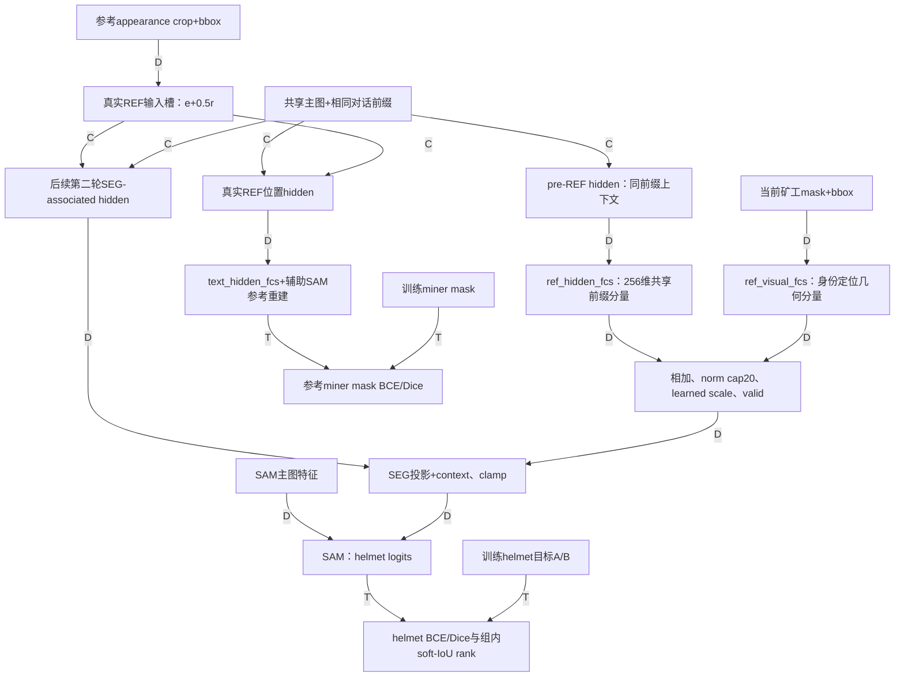

# 当前w15实际因果图

边标签：`D` = direct explicit input（代码显式传递/变换）；`C` = causally possible by decoder order（按因果decoder顺序允许，不等于已证明有效利用）；`T` = training-only（只在训练使用该监督关系）。每条边均标注。

**不存在“真实REF输入→pre-REF hidden”的边。** 未移位辅助重建可读取真实REF槽，但它不是当前输出context中的 `ref_hidden_fcs` 向量。辅助解码计算本身仍在inference返回之前，所以U→A标D而不是T；A输出的监督loss才标T。

依据：输入注入 `llava_llama.py:91`；移位context抽取 `LISA.py:433`；SEG `:346`；几何 `:894`；融合 `:918、487`；辅助 `:474、565、979`；训练loss `:644、652、670`。完整路径与源哈希见 alignment_receipt.json。离线Fidelity/CMSA/IER没有连回模型；它们不是训练反馈，也不是推理控制器。

当前最准确的简述是：**REF条件化的后续SEG语义 + 显式矿工几何prompt + counterfactual身份排序训练**。另保留输出context中的共享pre-REF前缀分量。不能将该分量讲成对注入身份的第二次语义读取。
