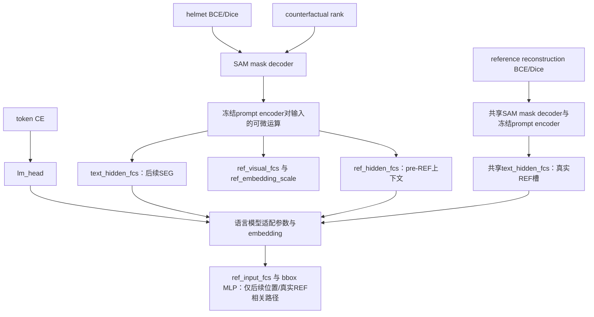

# 梯度可以去哪里？

下面箭头沿**反向传播方向**，只说明源码计算图允许。不是本轮autograd运行或实测梯度。参数是否被optimizer更新另看 TRAINABLE_PATH_AUDIT.md；非零梯度大小与性能因果作用均未测量。

## 按损失逐项读图

| 损失 | 允许到达的可训练模块（依现有配方） | 不应画出的路径 |
|---|---|---|
| CE，训练传labels后L:613 | lm_head、语言适配与token embeddings；位于REF后的受监督输出可回到ref_input_fcs/bbox MLP | CE不经过SAM、text_hidden_fcs、ref_hidden_fcs、ref_visual_fcs、输出scale |
| helmet BCE/Dice，L:644 | mask decoder；prompt输入→text_hidden_fcs/后续SEG→语言适配/embeddings→REF输入投影；context→ref_visual_fcs、scale、ref_hidden_fcs→前缀语言参数 | pre-REF分支本身不能沿反向图到达稍后REF输入；mask loss不经lm_head |
| reference BCE/Dice，L:670 | 共享mask decoder、text_hidden_fcs、真实REF槽的语言路径及REF输入投影 | 不使用ref_hidden_fcs、ref_visual_fcs或输出ref_embedding_scale；不经lm_head |
| rank，L:652–714 | 与helmet logits相同的上游；soft-IoU对sigmoid概率可微，训练目标为常量 | 不经过离线CMSA/Fidelity/IER；hinge关闭时该行不提供梯度 |

L完整路径为 `cmllm_remote/third_party/LISA/model/LISA.py`。输入注入用slice加法，未detach REF向量（llava_llama.py:112–135）。语言图 `llava_arch.py:191、249` 在当前`tune_mm_mlp_adapter=false`路径没有额外detach token embeddings；带detach的另一配置分支不能混用到这里。

SAM prompt encoder参数冻结仍可对text_embeds输入求导，这使其上游投影能够更新；冻结不等于整体no_grad。相反，SAM图像编码在L:295显式no_grad，CLIP wrapper forward也no_grad；它们不从这些loss学习图像特征。mm_projector在训练入口冻结，参考crop作为固定输入，不存在“梯度学习输入图片/标注”的解释。

共享语言参数可从pre-REF分支接收loss梯度，但不意味着该hidden已经含当前身份；参数被共同训练与前向单样本因果可见性是两回事。普通mask监督已经按身份目标处罚错误，rank额外显式约束同组身份间隔；CE/参考重建并不各自保证A/B helmet区分。

三层结论必须分开：**图连接可达** ≠ **历史参数实际更新已核验** ≠ **组件独立提升性能已证明**。当前没有匹配消融，也没有本轮梯度测量。
