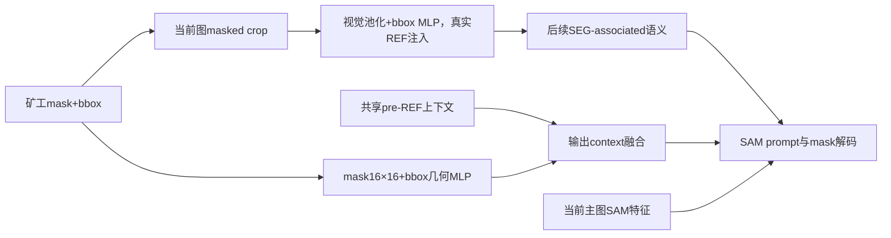
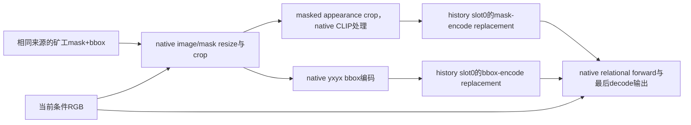

# 两种native memory路径

## CMA

依据：E:84、276；L:732、433、828、487。共享pre-REF分量不能读取稍后的REF注入，Cycle033已核验实际布局；身份仍可经后续SEG与独立几何路进入。全幅supplied miner mask明确经16×16投影到输出prompt，但不是直接把该mask当helmet答案。

## SegLLM

锚点：`cmllm_remote/external_baselines/segllm/memory_state.py:19–47` 构造并仅返回appearance、bbox和receipt；`run_smoke.py:55–65`种入history，`:99–110`核查实际replacement tensor hash，`:125`调用native inference并传`[appearance],[bbox],[],[]`，`:117、147`取最后输出。

A6000只读核查的上游源码HEAD为4593a069f09628ce3a5b46e657f5417fefd7be46。`llava/train/inference_cli.py:170–179`接收这些列表，`:226–242`将appearance和bbox替换到native slot（内部变量虽叫prev_output_mask，此处实际是masked appearance tensor）；`:254`之后才进入forward。本轮未调用它。

**独立supplied miner空间场在crop之后不作为该wrapper的另一个下游输入传入。** 外观tensor中仍有mask置黑产生的轮廓痕迹，bbox仍保留位置。不要把“没有独立mask字段”扩大成“模型没有几何信息”，也不声称已穷尽SegLLM所有可支持的交互接口；结论针对冻结port。

两者都是外部提供memory而非先自主预测miner再选择history；native placeholder可能在同次forward产生一个未采用的早期mask，wrapper不拿它替换supplied seed。这里没有新的baseline改造或能力限制实验。

E、L完整路径见 MEMORY_INTERFACE_PARITY.md。
