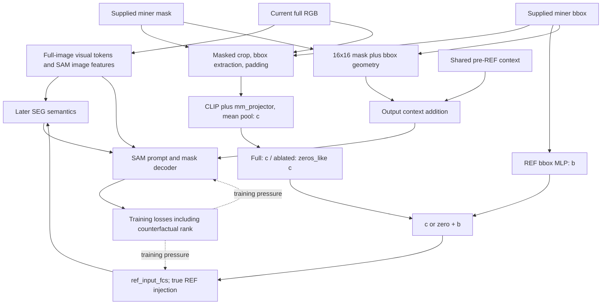

# One fixed-localization intervention

Current computation (source: LISA.py:732–924; llava_llama.py:91; counterfactual evaluator:84,202):

The only proposed difference is c -> 0 immediately after pooled crop features at LISA.py:764, before bbox addition. Keep crop construction and encoding executed for an otherwise identical computational path; do not replace crop pixels with a black image, which can yield nonzero encoder features. Preserve bbox MLP, REF projection, REF injection scale, full mask geometry, shared pre-REF output branch, auxiliary reconstruction and all losses. Apply intervention in both training and evaluation. No REF-index correction.

Fixed means paired raw RGB/query/mask/bbox/targets, preprocessing, architecture and starting parameters/settings. After learning, arm-specific parameters and derived hidden states may differ; holding final learned tensors equal would defeat the training comparison. Main-image appearance, bbox identity/localization and mask-shape geometry remain available in the zero arm. Removing crop features does not remove all appearance information or produce a pure bbox-only system.
